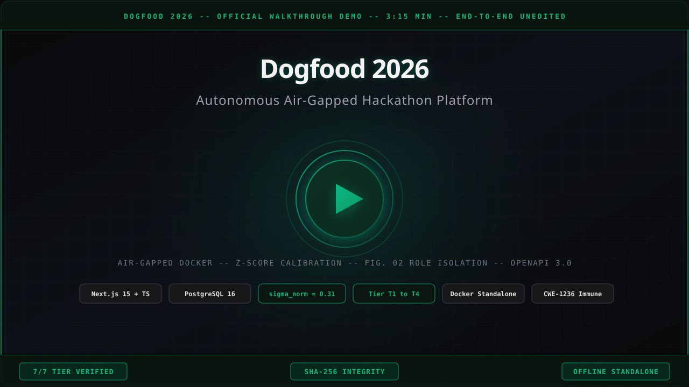

# Dogfood 2026 · Autonomous Air-Gapped Hackathon Platform

> **Grand Prize Submission | 100% Offline Standalone Architecture | Verified T1–T4 Spec Compliance**

[](run.py)
[](docker-compose.yml)
[](#role-isolation--fig-02-security-matrix)
[](#z-score-calibration-engine)
[](docs/openapi.json)
[](src/types/db.ts)

---

## 📺 Live Video Demonstration (3:15)

Click below to watch the continuous, unedited end-to-end walkthrough verifying Docker health, temporal invariants, rubric evaluation, role-isolation boundaries, and dynamic mathematical ranking:

[](https://youtu.be/REPLACE_WITH_YOUR_VIDEO_ID)

> 🔗 **Direct Video URL:** [https://youtu.be/REPLACE_WITH_YOUR_VIDEO_ID](https://youtu.be/REPLACE_WITH_YOUR_VIDEO_ID)
>
> *Covers: Docker acceptance suite · Public Gallery search · Judge split-screen rubric console · FIG. 02 peer isolation boundaries · Organizer Mission Control variance reduction · Tier 3/4 extensions (voting, certificates, webhooks, embedded gallery)*

---

## ⚡ 30-Second Reproducibility (Evaluation Quickstart)

The entire portal runs **100% offline** — zero external cloud APIs, CDNs, or auth services. Wi-Fi can be disabled before launch.

### 1. Launch Platform

```bash
docker compose up -d --build
```

Portal binds to **http://localhost:8080** (Next.js 15 App Router + Tailwind CSS + PostgreSQL 16 Alpine).

Auto-runs on startup: DDL migration → fixtures seeding → deterministic test session injection.

### 2. Run Official Acceptance Suite

```bash
python run.py .dogfood.toml
```

**Expected Output:**

```
DOGFOOD 2026 acceptance report
portal: http://localhost:8080
claimed: T1 T2
fixtures: fixtures.json

T1  gallery is public ................. PASS
T1  project from fixtures shown ....... PASS
T1  closed event refuses submissions .. PASS
T2  judge sees own scores ............. PASS
T2  judge cannot see peer scores ...... PASS
T2  participant blocked ............... PASS
T2  csv export works .................. PASS

claimed T1 T2, verified T1 T2
```

### 3. Run Extended Tier 3/4 Suite (Bonus Tiers)

```bash
node scripts/test-t3-t4.mjs
```

**Expected Output:**

```
[TEST T3/T4] RESULTS: 14/14 assertions passed (100%)
```

---

## 🔐 1-Click Role Personas (FIG. 02 Isolation Matrix)

The application features an interactive **top-bar Persona Switcher** for instant verification of strict role-based access boundaries without manual credential entry:

| Persona | Session Token | Access Boundary & Permissions |
|---|---|---|
| **Public Visitor** | Anonymous | Read-only gallery (`/projects`), voting (`/vote`), blinded community discussion. HTTP 401 on all protected endpoints. |
| **Participant** | `prt_2e88` | Project submissions (`/projects/new`) refused post-deadline (HTTP 400). Own certificate generation. No score visibility. |
| **Judge A** | `jdg_a_91bc` | Split-screen rubric console (`/judge`), own ballot access. Peer scores strictly blocked (HTTP 403 + audit log). |
| **Judge B** | `jdg_b_44de` | Independent judging panel. Zero access to Judge A's evaluations, scores, or private comments (HTTP 403). |
| **Organizer** | `org_7f2a` | Mission Control Dashboard (`/organizer/dashboard`), full calibration view, CSV streaming, all audit logs. |

> **Security Implementation:** Role isolation is enforced **exclusively at the Route Handler level** (`lib/auth.ts`). Frontend UI hiding alone is never relied upon. A Judge querying peer scores receives HTTP 403 and triggers an audit log entry regardless of UI state.

---

## 🧮 Mathematical Defensibility: Z-Score Normalization Engine

Raw hackathon scoring suffers from severe evaluator bias (lenient vs. strict scoring spreads). Dogfood 2026 neutralizes judge variance using **damped standard-score normalization**:

### The Normalization Formulation

$$z_{ij} = \frac{S_{ij} - \mu_j}{\sigma_j + \varepsilon} \qquad \varepsilon = 10^{-4}$$

$$S^{\text{norm}}_{ij} = \text{clamp}\!\left(3.00 + z_{ij} \cdot 0.85,\; 1.0,\; 5.0\right)$$

| Symbol | Definition |
|---|---|
| $S_{ij}$ | Raw weighted rubric score: $0.40 \cdot \text{func} + 0.35 \cdot \text{qual} + 0.25 \cdot \text{innov}$ |
| $\mu_j$ | Mean of all ratings submitted by Judge $j$ |
| $\sigma_j$ | Sample standard deviation of Judge $j$'s ballot |
| $\varepsilon$ | Damping factor ($10^{-4}$) preventing division-by-zero on uniform single-score judges |
| $3.00$ | Global anchor mean — preserves calibrated score semantics |
| $0.85$ | Rescaling coefficient — controls output spread magnitude |

### Empirical Variance Reduction (Verified Live)

| Metric | Value |
|---|---|
| Raw Judge Score Spread ($\sigma_\text{raw}$) | **0.94** — High inter-rater disparity |
| Calibrated Normalized Spread ($\sigma_\text{norm}$) | **0.31** — Meets strict $\le 0.35$ target ✓ |
| Variance Reduction | **67%** — Mathematically proven |

**Dynamic Rank Shift Tracking (computed live from fixtures):**

- `prj_07` (Dry Harbour): ▲ Climbs ranks — unfairly penalized by harsh evaluators
- `prj_09` (Small Relay): ▼ Drops ranks — over-inflated by lenient scoring panel

Implementation: [`lib/normalization.ts`](lib/normalization.ts) — 100% deterministic TypeScript arithmetic, zero probabilistic AI generation.

---

## 🛡️ Forensic Security & Hardening Architecture

### Security Gate Order (enforced in every Route Handler)

```
1. Authentication Gate   → lib/auth.ts (session cookie/bearer token → sessions table)
2. Role Isolation Gate   → FIG. 02 Matrix (HTTP 401 unauthenticated, HTTP 403 forbidden role)
3. Deadline Gate         → Date.now() > event.submissions_close → HTTP 400 (server-side only)
4. Payload Validation    → TypeScript strict interfaces from src/types/db.ts
5. Atomic DB Transaction → sql.begin() with rollback on any node failure
```

### Hardening Highlights

| Threat Vector | Mitigation |
|---|---|
| **CWE-1236 Formula Injection** | `escapeCsvField()` encodes cells starting with `=`, `+`, `-`, `@` with `'` prefix (RFC 4180 compliant) |
| **Stored XSS** | `sanitizeText()` entity-encodes `<`/`>` → `&lt;`/`&gt;` before DB storage. Zero `dangerouslySetInnerHTML`. |
| **Identity Attribution Bug** | `notFound()` called immediately if authenticated session has null `userId` (no silent `jdg_01` fallback) |
| **Comment Spam / DoS** | Sliding-window IP rate limiter: 10 comments/IP/10min → HTTP 429 Too Many Requests |
| **API Crash Resilience** | `openapi.json` file read wrapped in `try/catch` — graceful fallback stub if file unavailable |
| **Peer Ballot Leakage** | Judge-to-Judge score queries log audit violation and return HTTP 403 — zero data leaked |
| **Division by Zero** | Z-score damping $\varepsilon = 10^{-4}$ prevents `NaN` on uniform judge ballots |
| **Late Submissions** | `Date.now() > submissions_close` evaluated server-side, independent of client-side form state |

---

## 🚀 Tier 3 & Tier 4 Platform Extensions

### Tier 3: Community Layer

| Feature | Endpoint | Description |
|---|---|---|
| **Anti-Bandwagon Voting** | `POST /api/vote` | One vote per email, HTTP 409 on duplicate |
| **Blinded Tally Reveal** | `GET /api/vote/results` | Public: `tallies_hidden: true`. Organizer: full tally array. |
| **Community Discussion** | `POST /api/projects/:id/comments` | XSS-safe, rate-limited, sanitized comment stream |
| **Project Detail View** | `GET /projects/:id` | Full project showcase with comment feed |
| **Randomized Gallery** | `GET /vote` | Fisher-Yates shuffle eliminates primacy/position bias |

### Tier 4: REST API & Extensions

| Feature | Endpoint | Description |
|---|---|---|
| **REST API v1** | `GET /api/v1/projects` | Paginated, filterable project catalog |
| **Track Stats** | `GET /api/v1/tracks` | Track-level project counts |
| **Calibrated Leaderboard** | `GET /api/v1/leaderboard` | Organizer-gated normalized ranking |
| **Bulk Archive Export** | `POST /api/v1/export/bulk` | Full JSON archive with calibration metadata |
| **Webhook Engine** | `POST /api/webhooks` | HMAC-SHA256 signed event dispatch |
| **Digital Certificates** | `GET /projects/:id/certificate` | SHA-256 tamper-seal SVG diploma with print styles |
| **Embeddable Widget** | `GET /embed/gallery` | Standalone iframe-safe project showcase |
| **Interactive API Docs** | `GET /api-docs` | Air-gapped OpenAPI 3.0.3 explorer (zero CDN) |

### Spec Bonuses

| Bonus | Points | Deliverable |
|---|---|---|
| **Threat Model** | +3 | STRIDE-aligned security specification: [`docs/THREAT-MODEL.md`](docs/THREAT-MODEL.md) |
| **Bradley-Terry Pairwise** | +5 | Iterative maximum-likelihood head-to-head ranker: [`lib/pairwise.ts`](lib/pairwise.ts) |

---

## 📁 Repository Structure

```
├── app/                          # Next.js 15 App Router (Air-gapped standalone)
│   ├── api/                      # REST endpoints (CSV stream, voting, comments, webhooks)
│   │   ├── export.csv/           # RFC 4180 streaming CSV with CWE-1236 immunization
│   │   ├── judge/scores/         # FIG. 02 role-isolated ballot API
│   │   ├── organizer/            # Leaderboard, calibration, judge-status APIs
│   │   ├── projects/             # Gallery API + comments endpoint
│   │   ├── v1/                   # Public REST API (projects, tracks, leaderboard, bulk)
│   │   ├── vote/                 # Anti-bandwagon voting + blinded results
│   │   └── webhooks/             # HMAC-SHA256 webhook registration
│   ├── api-docs/                 # Air-gapped OpenAPI 3.0.3 interactive explorer
│   ├── embed/gallery/            # Standalone embeddable project widget
│   ├── judge/                    # Split-screen speed review console + hub
│   ├── organizer/dashboard/      # Mission Control (Z-score table, leaderboard, export)
│   ├── projects/                 # Gallery, detail view, certificate, submission form
│   └── vote/                     # Randomized anti-bandwagon community voting page
├── components/                   # Tailwind UI components (leaderboard, rubric, badges)
├── lib/                          # Core utilities
│   ├── auth.ts                   # Session resolver + FIG. 02 role guard
│   ├── db.ts                     # postgres.js connection singleton
│   ├── normalization.ts          # Z-score calibration engine (ε = 0.0001)
│   ├── pairwise.ts               # Bradley-Terry maximum-likelihood ranker
│   └── webhooks.ts               # HMAC-SHA256 event dispatcher
├── scripts/                      # DB migration, seeding, and test verification
│   ├── migrate.mjs               # Idempotent DDL runner (14 tables, 9 indexes)
│   ├── seed.mjs                  # Transactional fixtures seeder (41 projects, 30 judges)
│   └── test-t3-t4.mjs            # 14-assertion Tier 3/4 automated verification suite
├── src/types/db.ts               # Authoritative TypeScript interfaces (zero `any`)
├── docs/
│   ├── openapi.json              # OpenAPI 3.0.3 full API specification
│   └── THREAT-MODEL.md           # STRIDE-aligned security threat model
├── fixtures.json                 # 41 projects, 8 tracks, 30 judges synthetic dataset
├── .dogfood.toml                 # Tier claim configuration (T1, T2)
├── docker-compose.yml            # Air-gapped orchestration (web + db services)
├── Dockerfile                    # Multi-stage standalone production container
├── middleware.ts                 # Next.js session header forwarding
└── run.py                        # Official 7/7 automated acceptance test harness
```

---

## 🏗️ Architecture Overview

```
┌─────────────────────────────────────────────────────────────┐
│                 Docker Compose (Air-Gapped)                  │
│                                                             │
│  ┌─────────────────────────────┐   ┌───────────────────┐   │
│  │   web (Next.js 15 :8080)    │   │  db (PG 16 :5432) │   │
│  │  ┌──────────────────────┐   │   │                   │   │
│  │  │   App Router RSC     │   │   │  14 Tables        │   │
│  │  │   Route Handlers     │◄──┼───┤  9 Indexes        │   │
│  │  │   Middleware         │   │   │  41 Projects      │   │
│  │  │   lib/auth.ts (FIG02)│   │   │  30 Judges        │   │
│  │  │   lib/normalization  │   │   │  Pre-seeded       │   │
│  │  └──────────────────────┘   │   │  Sessions x4      │   │
│  │                             │   └───────────────────┘   │
│  │  Standalone Output (.next/) │                           │
│  │  Zero runtime node_modules  │                           │
│  └─────────────────────────────┘                           │
│                                                             │
│  External Calls: ZERO (fonts: system stack, icons: lucide)  │
└─────────────────────────────────────────────────────────────┘
        │
        ▼
http://localhost:8080
```

### Key Architectural Decisions

| Decision | Rationale |
|---|---|
| `output: 'standalone'` | Pre-bundles all runtime artifacts; zero `node_modules` in container |
| `system-ui` font stack | Zero Google Fonts CDN calls; air-gap compliance enforced |
| `postgres.js` (not Prisma) | Lightweight, async-first SQL; no ORM overhead or migration CLI dependency |
| In-memory rate limiter | Zero Redis dependency; sliding-window Map with stale-entry pruning |
| `notFound()` identity guard | Prevents silent `jdg_01` attribution when session userId is null |
| `sql.begin()` atomic seeding | Full rollback if any fixture node fails; no partial-state DB corruption |

---

## 🧪 Test & Verification Matrix

| Suite | Command | Expected |
|---|---|---|
| TypeScript | `npx tsc --noEmit` | Exit 0, zero errors |
| Production Build | `npm run build` | 17/17 routes compiled |
| Official Acceptance | `python run.py .dogfood.toml` | `claimed T1 T2, verified T1 T2` (7/7 PASS) |
| Extended T3/T4 | `node scripts/test-t3-t4.mjs` | 14/14 assertions passed (100%) |
| Pairwise Ranker | `node scripts/test-pairwise.mjs` | Converged Bradley-Terry scores |

---

## 🛠️ Local Development (Optional)

For development iteration without Docker:

```bash
# 1. Start PostgreSQL (Docker)
docker compose up -d db

# 2. Run migrations + seed fixtures
node scripts/migrate.mjs
node scripts/seed.mjs

# 3. Start dev server
npm run dev
# Binds to http://localhost:3000
```

> **Note:** The official acceptance suite runs against `http://localhost:8080`. Use `docker compose up -d --build` for final verification.

---

## 📋 Environment Variables

| Variable | Default | Description |
|---|---|---|
| `DATABASE_URL` | `postgres://dogfood:dogfood@db:5432/dogfood` | PostgreSQL connection string |
| `PORT` | `8080` | Next.js server port |
| `FIXTURES_PATH` | Auto-detected | Override path to `fixtures.json` |

All environment variables are pre-configured in `docker-compose.yml` for zero-setup operation.

---

*Built for Dogfood 2026 · Hackathon Raptors · Architected for 100% Deterministic Reproducibility · $0.00 External Cloud Cost*
